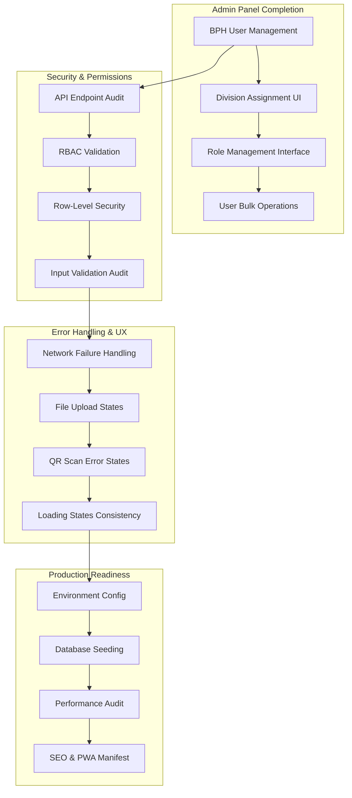
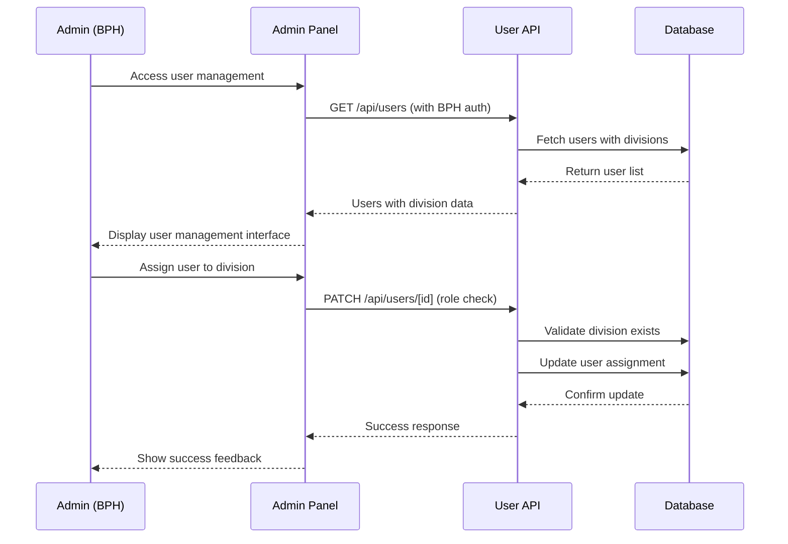
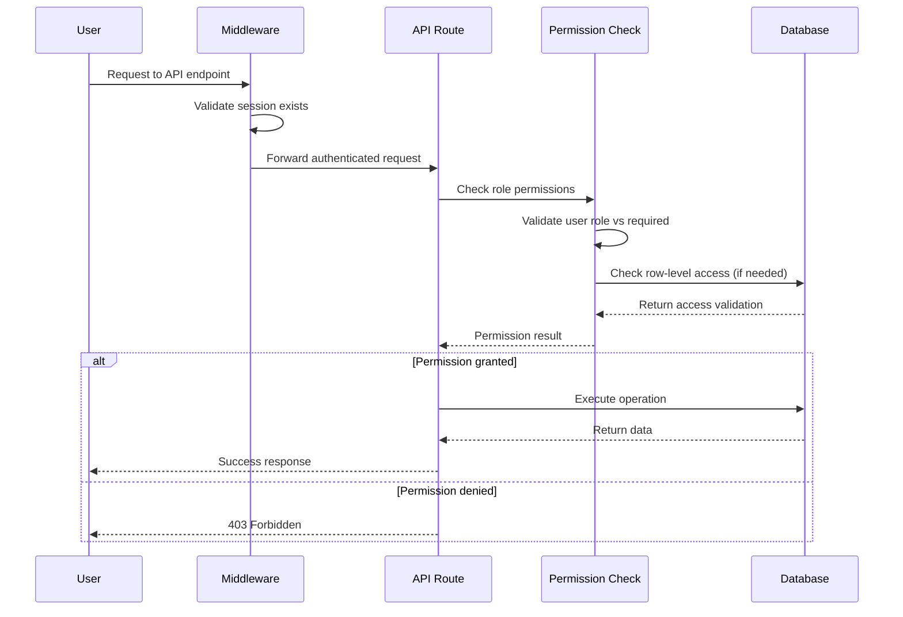

# Design Document: HIMASTA V1 Completion

## Overview

This design document addresses the final ~15% of work needed to complete HIMASTA V1 and make it production-ready. The system currently has solid foundations in authentication, announcements, QR attendance, documents, divisions, and basic notifications. The completion focuses on admin panel finalization, comprehensive security auditing, error handling improvements, and production environment setup.

## Architecture



## Sequence Diagrams

### Admin User Management Flow


### Security Validation Flow


## Components and Interfaces

### Admin Panel Components

#### UserBulkOperations Interface
```typescript
interface UserBulkOperations {
  selectedUsers: string[]
  bulkAssignDivision(divisionId: string | null): Promise<void>
  bulkUpdateRole(role: Role): Promise<void>
  bulkToggleStatus(isActive: boolean): Promise<void>
  exportUsers(format: 'csv' | 'xlsx'): Promise<void>
}
```

**Responsibilities**:
- Handle multiple user selection with checkboxes
- Execute bulk operations with proper validation
- Provide export functionality for user data
- Show progress feedback during bulk operations

#### ApprovalWorkflowManager Interface
```typescript
interface ApprovalWorkflowManager {
  pendingAnnouncements: PendingAnnouncement[]
  approveAnnouncement(id: string, notes?: string): Promise<void>
  rejectAnnouncement(id: string, reason: string): Promise<void>
  bulkApprove(ids: string[]): Promise<void>
  previewAnnouncement(id: string): Promise<AnnouncementPreview>
}
```

**Responsibilities**:
- Display pending announcements with preview capability
- Handle individual and bulk approval actions
- Require rejection reasons for audit trail
- Send notifications to authors upon approval/rejection

### Security Audit Components

#### APISecurityValidator Interface
```typescript
interface APISecurityValidator {
  validateRouteAccess(route: string, userRole: Role): boolean
  checkRowLevelSecurity(resource: string, userId: string, resourceId: string): boolean
  auditInputValidation(endpoint: string, payload: unknown): ValidationResult
  scanForSecurityVulnerabilities(): SecurityAuditReport
}
```

**Responsibilities**:
- Audit all API routes for proper authorization
- Validate row-level data scoping implementation
- Check input validation completeness
- Generate security compliance reports

### Error Handling Components

#### NetworkErrorBoundary Interface
```typescript
interface NetworkErrorBoundary {
  retryableOperations: Map<string, () => Promise<void>>
  handleNetworkError(error: NetworkError, operation?: string): void
  showOfflineIndicator(): void
  queueOperationsForRetry(operations: Operation[]): void
}
```

**Responsibilities**:
- Detect network connectivity issues
- Queue failed operations for automatic retry
- Show appropriate offline/connectivity indicators
- Handle graceful degradation for offline scenarios

## Data Models

### Enhanced User Management Model
```typescript
interface UserManagementData {
  user: {
    id: string
    name: string
    email: string
    nim?: string
    role: Role
    divisionId?: string
    isActive: boolean
    lastLogin?: Date
    createdAt: Date
  }
  division?: {
    id: string
    name: string
    slug: string
  }
  permissions: {
    canEditProfile: boolean
    canManageUsers: boolean
    canApproveAnnouncements: boolean
    canGenerateQR: boolean
  }
}
```

**Validation Rules**:
- BPH users cannot be deactivated by other BPH users
- Division assignment requires valid division ID
- Email must be unique across all users
- NIM must be unique if provided

### Security Audit Model
```typescript
interface SecurityAuditResult {
  endpoint: string
  method: string
  requiredRoles: Role[]
  hasAuthentication: boolean
  hasAuthorization: boolean
  hasInputValidation: boolean
  vulnerabilities: SecurityVulnerability[]
  riskLevel: 'low' | 'medium' | 'high' | 'critical'
}

interface SecurityVulnerability {
  type: 'missing_auth' | 'insufficient_validation' | 'data_exposure' | 'injection_risk'
  description: string
  impact: string
  recommendation: string
}
```

## Algorithmic Pseudocode

### Main Security Audit Algorithm

```pascal
ALGORITHM auditApplicationSecurity()
INPUT: application routes and middleware configurations
OUTPUT: comprehensive security audit report

BEGIN
  ASSERT application_routes is not empty
  ASSERT middleware_config exists
  
  // Step 1: Scan all API routes
  vulnerabilities ← []
  FOR each route IN application_routes DO
    ASSERT route.handler exists
    
    auth_check ← validateAuthentication(route)
    authz_check ← validateAuthorization(route)
    input_check ← validateInputSanitization(route)
    
    IF NOT auth_check.has_authentication THEN
      vulnerabilities.add(createVulnerability("missing_auth", route))
    END IF
    
    IF auth_check.has_authentication AND NOT authz_check.has_role_check THEN
      vulnerabilities.add(createVulnerability("insufficient_validation", route))
    END IF
  END FOR
  
  // Step 2: Validate data access patterns
  FOR each database_query IN extract_queries(application_routes) DO
    IF NOT has_row_level_security(database_query) THEN
      vulnerabilities.add(createVulnerability("data_exposure", database_query))
    END IF
  END FOR
  
  // Step 3: Generate report with risk assessment
  report ← generateSecurityReport(vulnerabilities)
  
  ASSERT report.total_endpoints > 0
  ASSERT vulnerabilities.length >= 0
  
  RETURN report
END
```

**Preconditions**:
- Application routes are properly defined and accessible
- Middleware configuration is available for analysis
- Database query patterns can be extracted from route handlers

**Postconditions**:
- Returns comprehensive security audit report
- All critical vulnerabilities are identified and categorized
- Report includes actionable recommendations for each vulnerability

**Loop Invariants**:
- All processed routes have been checked for authentication
- Vulnerability list maintains consistent structure throughout iteration

### User Bulk Operations Algorithm

```pascal
ALGORITHM executeBulkUserOperation(operation, userIds, parameters)
INPUT: operation type, list of user IDs, operation parameters
OUTPUT: batch operation result with success/failure details

BEGIN
  ASSERT operation IN ["assign_division", "update_role", "toggle_status"]
  ASSERT userIds.length > 0
  ASSERT current_user.role = "BPH"
  
  // Step 1: Validate all target users
  valid_users ← []
  errors ← []
  
  FOR each userId IN userIds DO
    user ← database.findUser(userId)
    
    IF user = null THEN
      errors.add("User not found: " + userId)
      CONTINUE
    END IF
    
    // Prevent BPH users from modifying other BPH users
    IF user.role = "BPH" AND operation ≠ "assign_division" THEN
      errors.add("Cannot modify BPH user: " + user.name)
      CONTINUE
    END IF
    
    valid_users.add(user)
  END FOR
  
  // Step 2: Execute operation in transaction
  BEGIN_TRANSACTION
    success_count ← 0
    
    FOR each user IN valid_users DO
      TRY
        CASE operation OF
          "assign_division": 
            user.divisionId ← parameters.divisionId
          "update_role":
            user.role ← parameters.role
          "toggle_status":
            user.isActive ← parameters.isActive
        END CASE
        
        database.save(user)
        success_count ← success_count + 1
        
      CATCH database_error
        errors.add("Failed to update " + user.name + ": " + database_error.message)
        
      END TRY
    END FOR
    
    IF errors.length = 0 THEN
      COMMIT_TRANSACTION
    ELSE
      ROLLBACK_TRANSACTION
    END IF
  
  // Step 3: Generate audit log
  audit_entry ← {
    operation: operation,
    executed_by: current_user.id,
    affected_users: success_count,
    errors: errors.length,
    timestamp: now()
  }
  
  database.saveAuditLog(audit_entry)
  
  ASSERT success_count >= 0
  ASSERT success_count <= userIds.length
  
  RETURN {
    success_count: success_count,
    errors: errors,
    total_processed: userIds.length
  }
END
```

**Preconditions**:
- User performing operation has BPH role
- All user IDs are valid strings
- Operation type is one of the supported bulk operations
- Database connection is available and stable

**Postconditions**:
- Returns detailed results of bulk operation
- All successful operations are committed to database
- Failed operations do not affect successful ones (partial success allowed)
- Audit trail is created for all operations

**Loop Invariants**:
- User validation maintains data integrity checks
- Transaction state remains consistent throughout batch processing
- Error collection preserves all failure information

### Network Error Recovery Algorithm

```pascal
ALGORITHM handleNetworkErrorWithRetry(operation, maxRetries)
INPUT: failed operation, maximum retry attempts
OUTPUT: operation result or final failure status

BEGIN
  ASSERT operation.type IN ["api_call", "file_upload", "qr_scan"]
  ASSERT maxRetries > 0 AND maxRetries <= 5
  
  retry_count ← 0
  base_delay ← 1000 // milliseconds
  
  WHILE retry_count < maxRetries DO
    TRY
      // Check network connectivity
      IF NOT isNetworkAvailable() THEN
        showOfflineIndicator()
        waitForNetworkRecovery()
      END IF
      
      // Execute operation with timeout
      result ← executeOperationWithTimeout(operation, 10000)
      
      // Operation successful
      hideOfflineIndicator()
      clearRetryQueue(operation.id)
      
      ASSERT result IS NOT null
      RETURN result
      
    CATCH network_error
      retry_count ← retry_count + 1
      
      // Exponential backoff with jitter
      delay ← base_delay * (2 ^ retry_count) + randomJitter(500)
      
      IF retry_count < maxRetries THEN
        showRetryMessage(retry_count, maxRetries)
        sleep(delay)
      END IF
      
    END TRY
  END WHILE
  
  // All retries failed
  queueOperationForLaterRetry(operation)
  showPersistentErrorMessage(operation.type)
  
  RETURN {
    success: false,
    error: "Network operation failed after " + maxRetries + " attempts",
    queued_for_retry: true
  }
END
```

**Preconditions**:
- Network error detection is functioning properly
- Operation can be safely retried without side effects
- User interface can display retry status messages

**Postconditions**:
- Operation either succeeds or fails with proper error handling
- Failed operations are queued for automatic retry when network recovers
- User receives appropriate feedback throughout the retry process

**Loop Invariants**:
- Retry count never exceeds maximum allowed attempts
- Network connectivity is checked before each retry attempt
- Exponential backoff delay increases appropriately with each retry

## Key Functions with Formal Specifications

### Function 1: validateUserPermissions()

```typescript
function validateUserPermissions(user: SessionUser, action: string, resourceId?: string): boolean
```

**Preconditions:**
- `user` is authenticated and has valid session
- `action` is a defined permission action
- `resourceId` is provided when action requires resource-level check

**Postconditions:**
- Returns boolean indicating permission status
- BPH users have access to all administrative actions
- KADIV users have access only to their division resources
- ANGGOTA users have read-only access to their permitted resources

**Loop Invariants:** N/A (no loops in permission validation)

### Function 2: auditAPIEndpointSecurity()

```typescript
function auditAPIEndpointSecurity(endpoint: string, method: string): SecurityAuditResult
```

**Preconditions:**
- `endpoint` is a valid API route path
- `method` is a valid HTTP method
- Route handler exists and is accessible for analysis

**Postconditions:**
- Returns comprehensive security audit result
- All security checks are performed (auth, authz, validation)
- Risk level is accurately assessed based on findings
- Recommendations are provided for any vulnerabilities found

**Loop Invariants:**
- Security check iteration maintains consistent validation criteria
- Vulnerability detection preserves all identified issues

### Function 3: executeFileUploadWithErrorHandling()

```typescript
function executeFileUploadWithErrorHandling(file: File, destination: string): Promise<UploadResult>
```

**Preconditions:**
- `file` is a valid File object with appropriate size and type
- `destination` is a valid storage path
- User has permission to upload to the specified destination
- Network connectivity is available

**Postconditions:**
- Returns upload result with success/failure status
- File is stored securely if upload succeeds
- Appropriate error messages are provided for failures
- Upload progress is tracked and reported to user

**Loop Invariants:**
- Retry attempts maintain file integrity
- Progress reporting remains accurate throughout upload process

## Example Usage

```typescript
// Example 1: Admin bulk user management
const bulkOperations = new UserBulkOperations(['user1', 'user2', 'user3'])
await bulkOperations.bulkAssignDivision('division-psdm-id')

// Example 2: Security audit execution
const auditResult = await auditAPIEndpointSecurity('/api/users', 'GET')
if (auditResult.riskLevel === 'high') {
  console.log('Critical security issues found:', auditResult.vulnerabilities)
}

// Example 3: Network error handling with retry
try {
  const result = await handleNetworkErrorWithRetry(uploadOperation, 3)
  showSuccessMessage(result)
} catch (error) {
  showErrorMessage('Upload failed after retries')
}
```

## Error Handling

### Error Scenario 1: User Management Permission Violation

**Condition**: Non-BPH user attempts to modify user roles or assignments
**Response**: Return 403 Forbidden with clear error message about insufficient permissions
**Recovery**: Redirect user to their appropriate dashboard based on role

### Error Scenario 2: Bulk Operation Partial Failure

**Condition**: Some users in bulk operation cannot be modified due to various constraints
**Response**: Process all valid users and return detailed report of successes and failures
**Recovery**: Allow user to review failures and retry individual operations if needed

### Error Scenario 3: Network Connectivity Issues

**Condition**: User loses network connection during critical operation
**Response**: Detect connectivity loss, queue operations for retry, show offline indicator
**Recovery**: Automatically retry queued operations when connectivity is restored

### Error Scenario 4: File Upload Failure

**Condition**: File upload fails due to size limits, type restrictions, or network issues
**Response**: Show specific error message with guidance on resolution
**Recovery**: Allow user to modify file (resize, convert format) and retry upload

## Testing Strategy

### Unit Testing Approach

Focus on testing individual components and functions in isolation:
- User permission validation logic
- Security audit algorithms  
- Error handling mechanisms
- Bulk operation logic

Test coverage should include:
- Happy path scenarios with valid inputs
- Edge cases like empty datasets and boundary values
- Error conditions and exception handling
- Permission boundary testing (role transitions)

### Property-Based Testing Approach

**Property Test Library**: fast-check for TypeScript/JavaScript property-based testing

Properties to test:
- User role permissions are consistently enforced across all operations
- Bulk operations maintain data integrity regardless of input order
- Security audits detect all known vulnerability patterns
- Error recovery mechanisms preserve system state

### Integration Testing Approach

End-to-end testing of complete workflows:
- Admin user management flow from UI to database
- Security audit pipeline including report generation
- File upload with error scenarios and retry logic
- Network error simulation and recovery testing

## Performance Considerations

- Bulk operations should process users in batches to avoid memory issues
- Security audits should be cached to avoid repeated expensive analysis
- File uploads should support resumable uploads for large files
- Database queries should use proper indexing for user management operations

## Security Considerations

- All admin operations require BPH role validation
- Audit trails must be maintained for all administrative actions
- Input validation must prevent injection attacks and data corruption
- Session management should include proper timeout and renewal mechanisms

## Dependencies

- Existing authentication system (NextAuth.js)
- Prisma database client and schema
- File storage system (Supabase Storage)
- UI component library (Radix UI)
- Validation library (Zod)
- Error tracking service (optional but recommended for production)

## Correctness Properties

*A property is a characteristic or behavior that should hold true across all valid executions of a system-essentially, a formal statement about what the system should do. Properties serve as the bridge between human-readable specifications and machine-verifiable correctness guarantees.*

### Property 1: User Management Display Completeness

*For any* set of users in the system, when a BPH user accesses the user management interface, all users SHALL be displayed with their complete role, division, and status information accurately represented.

**Validates: Requirement 1.1**

### Property 2: Bulk Operation Selection Consistency

*For any* selection of multiple users in the admin panel, the available bulk operations SHALL consistently match the user's permissions and selected user types.

**Validates: Requirement 1.2**

### Property 3: Division Assignment Validation

*For any* division assignment operation, the system SHALL validate division existence before updating user assignments and reject invalid division IDs with appropriate error messages.

**Validates: Requirement 1.3**

### Property 4: BPH User Protection

*For any* attempt to modify a BPH user's role or status by another BPH user, the system SHALL prevent the action and return a clear error message about insufficient permissions.

**Validates: Requirement 1.4**

### Property 5: Search and Filter Accuracy

*For any* search query or filter combination applied to the user list, the results SHALL include all users matching the criteria and exclude all users that do not match.

**Validates: Requirement 1.5**

### Property 6: Bulk Operation Transactional Integrity

*For any* bulk operation with mixed valid and invalid users, the system SHALL either complete all valid operations in a transaction or rollback all changes while providing detailed success/failure reporting.

**Validates: Requirement 1.6**

### Property 7: Approval Display Information Completeness

*For any* pending announcement requiring approval, the admin panel SHALL display complete preview information including author details and submission context.

**Validates: Requirement 2.1**

### Property 8: Approval Workflow Notification Consistency  

*For any* announcement approval decision (approve/reject), the system SHALL notify the author with appropriate details including optional notes or required rejection reasons.

**Validates: Requirements 2.2, 2.3**

### Property 9: Bulk Approval Processing

*For any* set of announcements selected for bulk approval, the system SHALL process all approvals atomically and provide detailed results for each announcement.

**Validates: Requirement 2.4**

### Property 10: Audit Trail Completeness

*For any* approval decision made in the system, a complete audit record SHALL be created containing decision maker, timestamp, decision type, and any associated notes or reasons.

**Validates: Requirement 2.5**

### Property 11: Row-Level Security Enforcement

*For any* user accessing data, the system SHALL enforce row-level security such that users can only access data within their permission scope based on their role and division assignment.

**Validates: Requirement 3.3**

### Property 12: Rate Limiting Consistency

*For any* sequence of requests to rate-limited endpoints, the system SHALL consistently enforce rate limits and block excessive requests while allowing legitimate usage patterns.

**Validates: Requirement 3.6**

### Property 13: Network Error Recovery Queue Integrity

*For any* operation that fails due to network issues, the retry queue SHALL preserve exact operation parameters such that delayed execution produces identical results to immediate successful execution.

**Validates: Requirement 4.2**

### Property 14: Error Message Specificity

*For any* file upload failure or QR scan failure, the system SHALL provide specific error messages that accurately describe the failure cause and suggest actionable resolution steps.

**Validates: Requirements 4.3, 4.4, 4.6**

### Property 15: File Upload Progress Accuracy

*For any* file upload operation, the progress indicators SHALL accurately reflect the actual upload percentage and provide realistic time estimates based on current transfer rates.

**Validates: Requirement 5.1**

### Property 16: Resumable Upload State Preservation

*For any* interrupted file upload, the system SHALL support resumption from the exact point of failure while maintaining file integrity throughout the process.

**Validates: Requirement 5.4**

### Property 17: File Integrity Validation

*For any* completed file upload, the system SHALL validate file integrity and automatically retry if corruption is detected, ensuring only complete and valid files are stored.

**Validates: Requirement 5.5**

### Property 18: Upload Confirmation Completeness

*For any* successfully uploaded file, the system SHALL provide complete confirmation details including file metadata and generated access links.

**Validates: Requirement 5.6**

### Property 19: QR Code Error Handling Completeness

*For any* QR scanning failure scenario, the system SHALL provide appropriate error messages and alternative methods based on the specific failure type (expired codes, invalid format, etc.).

**Validates: Requirement 6.3**

### Property 20: Attendance Session Persistence

*For any* QR attendance session, the session SHALL remain valid and accessible even when individual scan attempts fail, allowing users to retry until successful.

**Validates: Requirement 6.6**

### Property 21: Error Tracking Comprehensiveness

*For any* critical error occurring in production, the error tracking system SHALL capture complete error details including context, user information, and stack traces for debugging.

**Validates: Requirement 7.4**

### Property 22: Seeding Idempotency

*For any* database seeding operation executed multiple times, the system SHALL handle existing data gracefully without creating duplicates while ensuring all required sample data exists.

**Validates: Requirement 8.5**

### Property 23: Bulk Operation Performance Feedback

*For any* bulk operation processing multiple items, the system SHALL provide real-time progress feedback and complete the operation efficiently regardless of the number of items processed.

**Validates: Requirement 9.2**

### Property 24: Large File Upload Efficiency

*For any* large file upload operation, the upload mechanism SHALL not block the user interface and SHALL provide responsive feedback throughout the upload process.

**Validates: Requirement 9.4**

### Property 25: PWA Installation Cross-Platform Consistency

*For any* device attempting to install the PWA, the installation experience SHALL be seamless and consistent across different browsers and operating systems.

**Validates: Requirement 10.4**

### Property 26: Offline Data Access Availability

*For any* cached announcements and user profile information, the PWA SHALL provide offline access to the data even when network connectivity is unavailable.

**Validates: Requirement 10.6**
